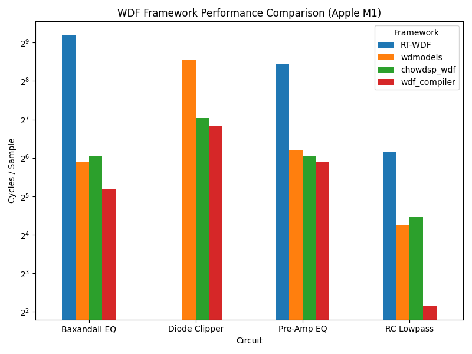
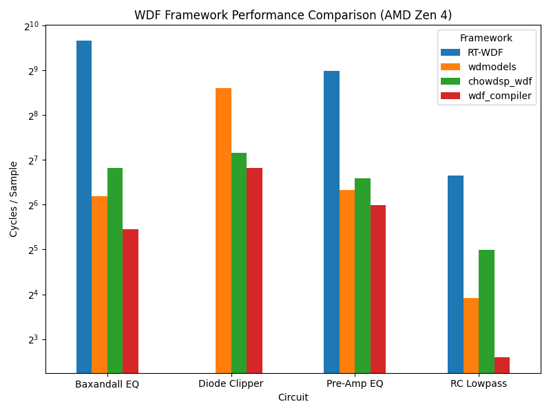

# WDF Compiler

WDF Compiler is a code generation system for developing circuit simulations using Wave Digital Filters (WDFs).

## Usage

WDF Compiler is intended to be used as follows:
1. Write your circuit description
2. Use `wdf_compiler` to generate your circuit simulation code
3. Compile the generated code into your own executable

### Circuit Description

`wdf_compiler` uses its own circuit description language. To write a circuit description, you can declare each WDF element in your circuit, followed by that element's "children". For example, here is a circuit description for a simple RC lowpass filter:
```
circuit:
IVs(Vin);
    Series(S1);
        R(R1, 1k);
        C(C1, 1u);

inputs:
Vin

outputs:
V:C1
```
For more examples of the circuit description language, see the `tests/` directory.

### Compilation Stage

Let's say that you've written your circuit description in a file called `my_circuit.wdf`. Simulation code can be generated for the circuit using the command:
```bash
wdf_compiler my_circuit.wdf my_circuit.h
```
By default, `wdf_compiler` will generate C++ code, using `float` as the base data type. `wdf_compiler` also supports generating code in JAI:
```bash
wdf_compiler -lang jai my_circuit.wdf my_circuit.jai
```

`wdf_compiler` also supports generating code using arbitrary data types:
```bash
wdf_compiler -dtype double my_circuit.wdf my_circuit.h
```

Run `wdf_compiler -help` to see additional options.

## Development

### Building

To build the `wdf_compiler` for yourself, you must have the JAI compiler installed. `wdf_compiler` is currently built with JAI beta version 0.2.023, but most recent versions should work.

To build the compiler, run:
```bash
jai compiler/wdf_compiler.jai
```

### Tests

To run the `wdf_compiler` tests, run:
```bash
./tests/test_runner.sh
```

### Performance Benchmarks

To run the `wdf_compiler` performance benchmarks, run:
```bash
./tests/test_runner.sh clang bench
```

## Performance Measurements

The following tables show the output of the performance benchmarks for `wdf_compiler` version 1.0.0. Along with `wdf_compiler`, the benchmarks compare these other WDF libraries: [`chowdsp_wdf`](https://github.com/Chowdhury-DSP/chowdsp_wdf), [`wdmodels`](https://faustlibraries.grame.fr/libs/wdmodels/), and [`RT-WDF`](https://github.com/RT-WDF/rt-wdf_lib).

**CPU: Apple M1**


| Circuit          | Framework          | ns/sample | ops/sample | cycles/sample | ops/cycle |
|------------------|--------------------|-----------|------------|---------------|-----------|
| RC Lowpass       | `RT-WDF`           | 22.54     | 251.02     | 72.07         | 3.48      |
| RC Lowpass       | `wdmodels`         | 6.02      | 17.01      | 19.04         | 0.89      |
| RC Lowpass       | `chowdsp_wdf`      | 6.97      | 18.01      | 22.09         | 0.82      |
| RC Lowpass       | `wdf_compiler`     | 4.64      | 13.00      | **14.94**     | 0.87      |
|                  |                    |           |            |               |           |
| Pre-Amp EQ       | `RT-WDF`           | 107.66    | 1007.10    | 346.18        | 2.91      |
| Pre-Amp EQ       | `wdmodels`         | 22.91     | 83.02      | 73.30         | 1.13      |
| Pre-Amp EQ       | `chowdsp_wdf`      | 20.71     | 56.01      | 66.33         | 0.84      |
| Pre-Amp EQ       | `wdf_compiler`     | 18.09     | 51.02      | **58.02**     | 0.88      |
|                  |                    |           |            |               |           |
| Diode Clipper    | `wdmodels`         | 116.52    | 566.93     | 374.53        | 1.51      |
| Diode Clipper    | `chowdsp_wdf`      | 41.05     | 102.04     | 131.78        | 0.77      |
| Diode Clipper    | `wdf_compiler`     | 35.08     | 76.02      | **112.79**    | 0.67      |
|                  |                    |           |            |               |           |
| Baxandall EQ     | `RT-WDF`           | 183.01    | 2028.18    | 588.16        | 3.45      |
| Baxandall EQ     | `wdmodels`         | 18.54     | 163.02     | 59.23         | 2.75      |
| Baxandall EQ     | `chowdsp_wdf`      | 20.52     | 156.01     | 65.55         | 2.38      |
| Baxandall EQ     | `wdf_compiler`     | 11.38     | 49.01      | **36.44**     | 1.34      |


**CPU: AMD Ryzen Zen 4**


| Circuit          | Framework          | ns/sample | ops/sample | cycles/sample | ops/cycle |
|------------------|--------------------|-----------|------------|---------------|-----------|
| RC Lowpass       | `RT-WDF`           | 20.31     | 268.06     | 99.85         | 2.68      |
| RC Lowpass       | `wdmodels`         | 2.98      | 14.51      | **15.03**     | 0.97      |
| RC Lowpass       | `chowdsp_wdf`      | 6.44      | 38.02      | 31.73         | 1.20      |
| RC Lowpass       | `wdf_compiler`     | 3.83      | 16.01      | 19.04         | 0.84      |
|                  |                    |           |            |               |           |
| Pre-Amp EQ       | `RT-WDF`           | 99.98     | 1132.51    | 505.42        | 2.24      |
| Pre-Amp EQ       | `wdmodels`         | 15.92     | 128.05     | 80.29         | 1.59      |
| Pre-Amp EQ       | `chowdsp_wdf`      | 18.96     | 136.05     | 95.77         | 1.42      |
| Pre-Amp EQ       | `wdf_compiler`     | 13.99     | 54.04      | **70.58**     | 0.77      |
|                  |                    |           |            |               |           |
| Diode Clipper    | `wdmodels`         | 90.17     | 354.14     | 389.10        | 0.91      |
| Diode Clipper    | `chowdsp_wdf`      | 28.31     | 126.24     | 141.86        | 0.89      |
| Diode Clipper    | `wdf_compiler`     | 22.84     | 96.07      | **113.12**    | 0.85      |
|                  |                    |           |            |               |           |
| Baxandall EQ     | `RT-WDF`           | 160.94    | 2406.47    | 805.60        | 2.99      |
| Baxandall EQ     | `wdmodels`         | 14.66     | 261.04     | 72.95         | 3.58      |
| Baxandall EQ     | `chowdsp_wdf`      | 22.17     | 199.19     | 112.25        | 1.77      |
| Baxandall EQ     | `wdf_compiler`     | 8.66      | 84.02      | **43.60**     | 1.93      |


## In The Wild

`wdf_compiler` has been successfully used for several prototype and professional projects, including:
- [`wdf_compiler_plugin`](https://github.com/jatinchowdhury18/wdf_compiler_plugin): An audio plugin for prototyping WDF circuit models, with hot reloading.
- [Tekno](https://babyaud.io/tekno): A drum machine plugin containing several WDF circuit models. `wdf_compiler` was able to improve the performance of these circuit models by 20-50%.

## License

WDF Compiler is open-source software published under the MIT.
